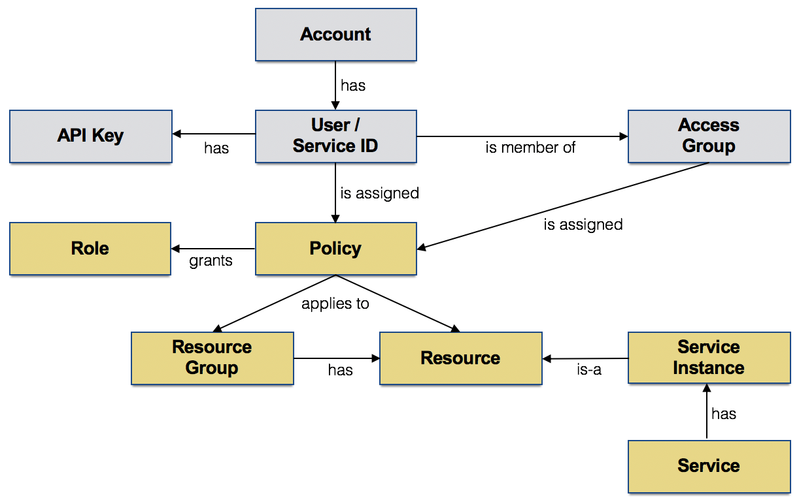

# Architecting for the Cloud – Security Considerations
Cloud Security is the forefront of any on-line business today, and it is everyone's responsibility. Security features should be your first concern when it comes to the cloud.  Cybersecurity threats are ever increasing, and it's not only relevant to cloud infrastructure; they are layers, and layers from application logic, presentation, operating systems, data security, network and hypervisor no one escapes; and your concerns are justified!

Security on the cloud is paramount, and this is why it is by far one of the hottest topics of the Cloud; all companies have their views and opinions on this!
Cloud Security is the use of the latest technologies and security techniques to protect your data, applications, and infrastructure associated with cloud computing.

Learn about the importance of Cloud Security through data ownership, visibility, protection, and identity and access management.

This blog opens the door and creates a platform to discuss about the traditional security challenges such as loss of data, physical damage to infrastructure, and compliance risk are well known, the manifestation of such threats in a cloud environment can be remarkably different.

Cloud security threats continue to strike business organizations from three angles:
- People
- Process
- Technology
   - System
   - Network
   - Physical

Business organizations need advanced capabilities to disrupt the prevalent security threats from sophisticated attack vectors and safeguard mission-critical data and apps in the cloud.

## Understand Security
For the longest time, security was considered to be the most significant risk for any company when it comes to the adoption of cloud solutions. For most large companies, data is one of the most valuable assets, and its safety cannot be compromised, be it in terms of data privacy or resistance to external threats. Naturally, therefore, the biggest challenge faced by cloud providers is gaining the trust of enterprises. [*](https://medium.com/@EXPERTinCRM/salesforce-cloud-security-e03450dbf08c)
Proactive defense is paramount in cloud where automation allows an attacker to move faster than ever. These best practices are very crucial for your cloud security, but they are also only the tip of the iceberg.
Credentials such as:
- Passwords
- Tokens (JWT, SAML, etc.)
- Access Keys (API keys, hardware tokens )
- Key Pairs (RSA)
- Certificates (X.509)

Penetration testing tools, vulnerabilities, and offensive security techniques have dominated security conferences and security-related open source for some time.

| Category                                   | Architect | Developer | QA   | Operations | Security Focal | Offering Manager |
| ------------------------------------------ | --------- | --------- | ---- | ---------- | -------------- | ---------------- |
| 1.   Security Testing                      |           | ✔         | ✔    | ✔          | owner          | ✔                |
| 2.   Encryption                            | owner     | ✔         |      |            |                | ✔                |
| 3.   Network                               | owner     |           |      | ✔          |                | ✔                |
| 4.   DevSecOps                             | ✔         |           |      | owner      | ✔              | ✔                |
| 5.   Business Continuity/Disaster Recovery | ✔         |           |      | owner      |                | ✔                |

## Shared Responsibility
Cloud security is a shared responsibility of the cloud provider and customer.
Understanding your role and the role of your cloud provider will not only help you make the best decision concerning your cloud infrastructure, it will also ensure that once implemented, your cybersecurity strategy will efficiently and cost-effectively protect your data from threats to the cloud.[*](https://medium.com/aws-activate-startup-blog/a-users-guide-to-cloud-security-for-startups-3ec0c83df9f4)

### Security in the Cloud
Measures what the customer implements and operates, related to the security content and application that runs on the CSP (Cloud Service Provider).

Your service provider is responsible for 100% of the foundational services, such as computer power, storage, database, and networking services. At the network layer, your service provider is responsible for network segmentation, perimeter services, some DDoS and spoofing.[*](https://medium.com/aws-activate-startup-blog/a-users-guide-to-cloud-security-for-startups-3ec0c83df9f4)

The end user, are responsible for network threat detection, reporting, and any incident response. At the host layer, you are responsible for access management, patch management, configuration hardening, security monitoring, and log analysis. The application components of your site are 100% your responsibility. See the chart below for a breakdown of responsibilities between you (the customer) and your service provider.[*](https://medium.com/aws-activate-startup-blog/a-users-guide-to-cloud-security-for-startups-3ec0c83df9f4)

Who are we doing business with?

| "Stack"   Layer                  | Controls                                                     |
| -------------------------------- | ------------------------------------------------------------ |
| Application Logic + Presentation | WAF, AIM, Scans/Pen tests                                    |
| Operating Systems                | Configuration, Vulnerability Scanning, Backups, user/privilege management |
| Data                             | Encryption, Backups, DLP                                     |
| Network                          | Access Controls, Firewalls, Routing, DDoS Defense,  Intrusion Detection System (IDS)            |
| Hypervisor                       | Configuration, access controls, user/privilege management    |

## Identity and access Management for cloud

### Accreditations and Certifications
One of the best ways to avoid security issues is to have a proactive approach. That’s true whether you have applications in the cloud or not.
certify and maintain industry standards such as:

- PCI-DSS
- HIPAA
- CIS
- SOC-2
- NiST
- ISO

### IAM definition

Identity and access management (IAM) in enterprise IT is about defining and managing the roles and access privileges of individual network users and the circumstances in which users are granted (or denied) those privileges. Those users might be customers (customer identity management) or employees (employee identity management. The core objective of IAM systems is one digital identity per individual. Once that digital identity has been established, it must be maintained, modified and monitored throughout each user’s "access lifecycle." 

Thus, the overarching goal of identity management is to "grant access to the right enterprise assets to the right users in the right context, from a user’s system onboarding to permission authorizations to the offboarding of that user as needed in a timely fashion,"

IAM systems provide administrators with the tools and technologies to change a user’s role, track user activities, create reports on those activities, and enforce policies on an ongoing basis. These systems are designed to provide a means of administering user access across an entire enterprise and to ensure compliance with corporate policies and government regulations. 
Identity & Access Management  lets administrators authorize who can take action on specific resources, giving you full control and visibility to manage cloud resources centrally while giving a unified view into security policy across your entire organization, with built-in auditing to ease compliance processes. 

Identity provisioning challenges
The biggest challenge for cloud services is identity provisioning. This involves secure and timely management of on-boarding (provisioning) and off-boarding (deprovisioning) of users in the cloud.

The right roles !
IAM must provide the right tools to manage resource permissions with minimum fuss and high automation. Users get access only to what they need to get the job done, and admins can easily grant default permissions to entire groups of users. 

### IAM tools
Identity and management technologies include (but aren’t limited to) password-management tools, provisioning software, security-policy enforcement applications, reporting and monitoring apps and identity repositories. Identity management systems are available for on-premises systems, such as Microsoft SharePoint, as well as for cloud-based systems, such as Microsoft Office 365.

### Granular resource control
IAM must enable you to grant access to cloud resources at fine-grained levels, well beyond project-level access.

### Single sign-on (SSO)
Improve employee experience and increase productivity with one-click access to thousands of pre-integrated apps, both in the cloud and on-premises.

### Multi-factor authentication (MFA)
Protect your user accounts and company data with a wide variety of MFA verification methods such as phishing-resistant security keys, mobile push notifications, and one-time passwords.

### Mobile device management (MDM)
Keep employees productive and data more secure with easy-to-set-up mobile management for Android, iOS, Windows, and other smartphones.

Here are a few questions that must be asked, in order to build an optimum user provisioning model for effective IAM controls:
- How many users on average will be accessing the system?
- What system resources are needed per user, on average?
- Are multiple logons allowed for a single username? This has a potential impact on capacity planning, since these numbers are not predictable.
- Are clients allowed to create an unlimited number of users? Capacity planning could be affected here too, as in such cases clients tend to create users unnecessarily and also forget to remove users no longer required, thus blocking precious system resources.
- What are the scalability requirements for the next 3/6/12 months?
- Is the infrastructure adequate to meet these scalability requirements?
- How will you handle performance spikes? Up to what level and for how long can the system continue to work without affecting user productivity?
- What are the processes for IAM in the cloud to ensure that system administrators are efficiently informed about users added to or deleted from the system?
- Will users be disabled or deleted once requests for removal of users come through?
- Will the data created by dropped users be retained or not? Do client administrators decide this? 
- Will you allow this data to be merged with existing users?

Identity analytics (IA) will allow security teams to detect and stop risky identity behaviors using rules, machine learning, and other statistical algorithms.
IAM systems must be flexible and robust enough to accommodate the complexities of today’s computing environment.  

### Our Security Goals Have Not Changed

Confidentiality, Integrity and Availability - Basics of Information Security
CIA triad.

- **Confidentiality** ensures that information is accessible only by authorized individuals; (BYOA or Bring-Your-Own-Access)
- **Integrity** ensures that information is reliable, consistence, accuracy; and
- **Availability** ensures that data is available and accessible to satisfy business needs and no sinple point of failure

- Auditing
**Transparency: when your data is used, how it's used, where is your data is stored, everything about how your data is managed**

## Build in Security at Every Layer

Every cloud architecture is composed of unique layers that can be coupled in integrated (or not)

| Security Considerations                      | Cloud Model                      |                                  |                                        |
| -------------------------------------------- | -------------------------------- | -------------------------------- | -------------------------------------- |
|                                              | **Software-as-a-Service (SaaS)** | **Platform-as-a-Service (PaaS)** | **Infrastructure-as-a-Service (IaaS)** |
| Virtual   network security                   |                                  |                                  | ✔                                      |
| VM Instance   template management            |                                  |                                  | ✔                                      |
| System build   configuration                 |                                  | ✔                                | ✔                                      |
| Antimalware                                  |                                  | ✔                                | ✔                                      |
| Data security   at rest and in transit       | ✔                                | ✔                                | ✔                                      |
| Administrative   console security            | ✔                                | ✔                                | ✔                                      |
| Roles and   priviledges                      | ✔                                | ✔                                | ✔                                      |
| Logs and   monitoring for activity           | ✔                                | ✔                                | ✔                                      |
| Sensitive data   and policy compliance (DLP) | ✔                                | ✔                                | ✔                                      |

## Cloud Model Selection
The majority of organizations will have applications housed across hybrid environments
- Private cloud
- Public cloud
- Hybrid cloud

| Domain                          | Consideration/Discussion point                               |
| ------------------------------- | ------------------------------------------------------------ |
| Compliance and risk management  | Organizations shifting part of their business to the cloud are still responsible for the compliance, risk, and security management |
| Indentity and access management | Identities may come from different providers, and providers must be able to federate from on-premise to cloud, as well as enable collaboration across   organization and country borders |
| service integrity               | Cloud-based services should be engineered and operated with security in   mind, and the operationla process should be integrated into the   organization's security management |
| Endpoint integrity              | As cloud-base services originate - and are then consumed - on-premise, the security, compliance, and integrity of the endpoint have to be part of   any security consideration |
| Information proctection         | Cloud services require reliable for protecting information before, during and after the transaction |
| Data sovereignty                | Which data is residing where? What are the implications of a breach to CSP? |

Big data and data analytics
Hackers, attackers, thieves

- What are the SLAs
- What happen to a breach

## Security & Compliance Assessment

### Potential Attack Vectors Abound
- Authentication attacks
   - Repudiation attacks
- Eavesdropping
   - Loss of intellectuall property
- Proxy attacks
   - Man-in-the-middle attacks
   - Hijacking and side-jacking attacks
- Injection attacks
- Cross-site scripting (XSS) and request forgeries
- Denial of service

### Existing Applications – Security and Compliance:
1.	What Identity Management system is used by the existing application?
2.	How are Security and Access roles/groups defined and managed currently?
3.	How are keys managed by the current App?
4.	Is someone else managing security for the client?  If so, who?
5.	How is application code and containers currently being tested for vulnerabilities and threats?

### Known Application Requirements – Security and Compliance:
1.	What Identity Management system is used by the App?
2.	How are Security and Access roles/groups defined and managed?
3.	What Security, Privacy and compliance standards does the App need to adhere to? (PCI, HIPPA, GDPR...)
4.	What Data Residency rules will the App need to comply to?
5.	What are the data transit rules the app need to apply?
6.	What encryption requirements does the App have?
7.	How are keys managed by the App?
8.	Has a security incidence response process been documented and validated?
9.	What are the security incident response time requirements?
10.	Has a SOC RACI been developed between IBM, the client and 3rd party service providers, is any?
11.	How often will security incident response drills be run?
12.	What are the requirements for penetration testing?
13.	Is someone else managing security for the client?  Who?
14.	How is application code and containers being tested for vulnerabilities and threats?
15.	Is the customer following Center for Internet Security (CIS) Controls or the Cloud Security Alliance (CSA) Cloud Controls Matrix?

### Infrastructure Delivery – Security
1.	What are the IP requirements of the current application?  
2. 	Does the current application need access to specific ports?
3. 	What are the Distributed Denial of Service (DDoS) requirements for the current solution?
4. 	What are the Internet access requirements?
5. 	What are the VPN access requirements?
6. 	Does the solution require the use of a Global Load Balancer?  If so which one?

### Known Application Requirements – Data
1.	Can the all data be exposed to the public access network paths?
2.	Is a VPN sufficient security?
3.	Is the rate of ingest less than 1000s of write per second?
4.	Is the amount of data to be stored less than single terabytes?
5.	Are the data format(s) known, common to Cloud and defined (structured, JSON, ...)?
6.	Is the solutions success dependent on very high quality trusted data?
7.	Does the attributes/schema of data the solution is based on change frequently?
8.	Are there regulations, business requirements, or uses that require the availability of the data to be retained to increase the amount of data to be stored beyond single terabytes?
9.	Are there requirements for limiting/auditing the access to the data?

## DevSecOps Integrates Security
DevSecOps is one way to better automate and integrate security for the cloud. DevSecOps strives to automate core security tasks by embedding controls and process into the DevOps workflow. Its focused primarily on automating code security and testing; such as code analysis and unit tests.

It encompasses more operations-centric controls like:
- Logging and event monitoring
- Configuration and patch management
- User and privilege management
- Vulnerability assessment
- Define policies for the components, networks and more
- Define security stories, who is going to use it, what is the end-game?

## Security as Code
Taking similar approach to DevOps, but the focus should be on:
- Code security
- Code repositories
- Automations tools
- Automated code scans upon check-in
- Automated app scanning in test/staging
- Automated Server, Container, and Network configuration checks via policy
- Continuous monitoring of all core components in the Deployment Pipeline
- Orchestrations platform
- Gateways and network connectivity
- Authentication/Authorization and privileged suer monitoring and management are critical

Left to right:

## Financial Analysis
- Economic benefits
- Operational benefits
- Transition costs
- Business, operational and technical risks

## References:
* [Architecting for the Cloud – Security Considerations](https://www.youtube.com/watch?v=1WlLvy8SyJY)
* [An Introduction to Cloud Computing Security Basics](https://www.youtube.com/watch?v=7ChD2UKoQDs)
* [What is the CIA Triad?](https://www.varonis.com/blog/cia-triad/)
* [CIA Triad](https://medium.com/@angel_alexander.arquero/cia-triad-c388da6dafa2)
* [Confidentiality, Integrity and Availability](https://www.testingexcellence.com/confidentiality-integrity-availability/)
* [An Introduction to Cloud Computing Security Basics](https://www.youtube.com/watch?v=7ChD2UKoQDs)
* [A Cloud Security Architecture Workshop](https://www.youtube.com/watch?v=4TxvqZFMaoA)
* [What is DevSecOps? Developing more secure applications](https://www.csoonline.com/article/3245748/what-is-devsecops-developing-more-secure-applications.html)
* [How to Become a Security Architect](https://www.youtube.com/watch?v=OOAuWu3p4mM)
* [DevSecOps: The Next Wave of Cloud Security](https://www.botmetric.com/blog/devsecops-next-wave-cloud-security/)
* [Cloud Security Tutorial | Cloud Security Fundamentals | AWS Training | Edureka](https://www.youtube.com/watch?v=0lw4KU5wHsk)
* [Cloud Security Design Principles to Follow in 2018](https://medium.com/@nutanix/cloud-security-design-principles-to-follow-in-2018-9423d5fa7769)
* [The 5 Pillars Of AWS Well-Architected Framework](https://medium.com/@nutanix/the-5-pillars-of-aws-well-architected-framework-84345ca54a30)
* [Cloud Security New Models - Best Model for Cloud Security](https://www.youtube.com/watch?v=xbD_rr4YfZw)
